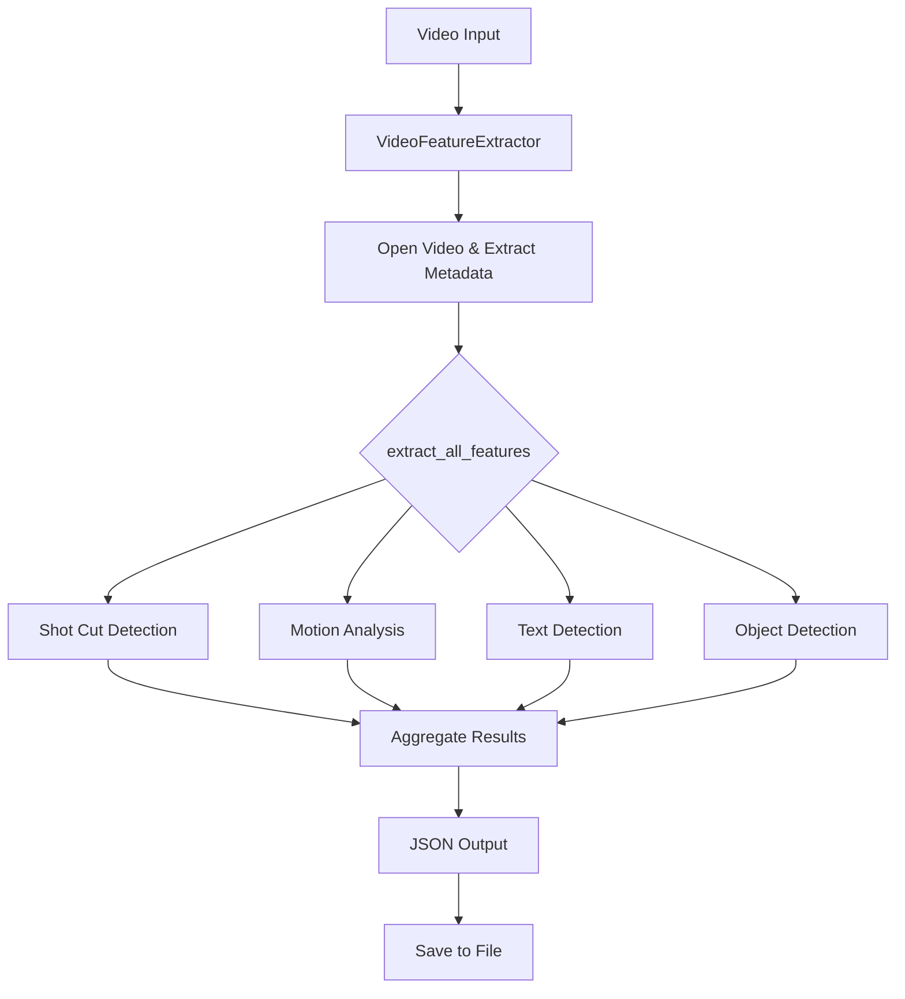

# Video Feature Extractor

Python tool for extracting visual features from videos using computer vision and deep learning techniques.

## Overview

This tool analyzes videos to extract key features including shot cuts, motion patterns, text content, and object/person detection using YOLO models and OpenCV.

## Architecture

The system is built around a single `VideoFeatureExtractor` class that processes videos through four independent analysis pipelines:

- **Shot Cut Detection**: Histogram-based scene change detection
- **Motion Analysis**: Optical flow calculation for movement patterns
- **Text Detection**: OCR-based text extraction using Tesseract
- **Object Detection**: YOLO-based person and object identification

Each pipeline operates independently and can be toggled on/off during extraction.



## Installation

```bash
pip install -r requirements.txt
```

## Usage

### Basic Example

```python
from pathlib import Path

# Analyze all videos in a folder
video_folder = Path("./videos")
video_files = [str(f) for f in video_folder.glob("*") if f.is_file()]
yolo_model_version = "yolo12l"  # Options: yolo12s, yolo12m, yolo12l, yolo12x

results = analyze_videos(video_files, yolo_model_version)
```

## Key Components

### Shot Cut Detection

Uses histogram comparison to identify scene transitions:

```python
def detect_shot_cuts(self, threshold: float = 0.5) -> Dict:
    # Calculate histogram for each frame
    hist = cv2.calcHist([gray], [0], None, [256], [0, 256])
    hist = cv2.normalize(hist, hist).flatten()
    
    # Compare with previous frame
    diff = np.sum(np.abs(hist - prev_hist))
    if diff > threshold:
        cuts.append({"frame": frame_count, "timestamp": timestamp})
```

### Motion Analysis

Calculates optical flow between frames:

```python
def analyze_motion(self) -> Dict:
    flow = cv2.calcOpticalFlowFarneback(
        prev_gray, gray, None, 0.5, 3, 15, 3, 5, 1.2, 0
    )
    magnitude = np.sqrt(flow[..., 0] ** 2 + flow[..., 1] ** 2)
    avg_magnitude = np.mean(magnitude)
```

### Object Detection

Uses YOLO for real-time object and person detection:

```python
def detect_objects_and_people(self) -> Dict:
    results = self.yolo_model(frame, verbose=False)
    for result in results:
        for box in result.boxes:
            cls = int(box.cls[0])
            if cls == 0:  # person class
                person_count += 1
```

## Output Format

Results are saved as JSON with the following structure:

```json
{
  "metadata": {
    "video_path": "videos\\test_video.mp4",
    "fps": 30.0,
    "total_frames": 906,
    "duration_seconds": 30.2,
    "sample_rate": 5
  },
  "shot_cuts": {
    "total_cuts": 2,
    "cuts": [
      {
        "frame": 250,
        "timestamp": 8.33,
        "difference": 0.54
      },
      {
        "frame": 380,
        "timestamp": 12.67,
        "difference": 0.65
      }
    ],
    "average_shot_length": 15.1
  },
  "motion_analysis": {
    "average_motion": 3.61,
    "max_motion": 10.45,
    "min_motion": 0.0,
    "motion_std": 1.86
  },
  "text_detection": {
    "text_present_ratio": 0.533,
    "frames_with_text": 8,
    "total_sampled_frames": 15,
    "top_keywords": [
      "(official",
      "that",
      "childhood",
      "memories",
      "she",
      "takes",
      "away",
      "special",
      "place",
      "and"
    ],
    "unique_words": 25
  },
  "object_detection": {
    "total_persons_detected": 9,
    "total_objects_detected": 1,
    "person_ratio": 0.9,
    "object_ratio": 0.1,
    "avg_persons_per_frame": 0.9,
    "avg_objects_per_frame": 0.1
  }
}
```

## Performance Tuning

- **sample_rate**: Controls frame sampling frequency (default: 5)
- **YOLO model**: Trade-off between speed and accuracy (s < m < l < x)
- **Shot detection**: samples every 5 frames (independent of sample_rate)
- **Motion analysis**: samples every `sample_rate` frames
- **Text detection**: samples every `sample_rate * 2` frames
- **Object detection**: samples every `sample_rate * 3` frames

## Running the Tool

```bash
python main.py
```
